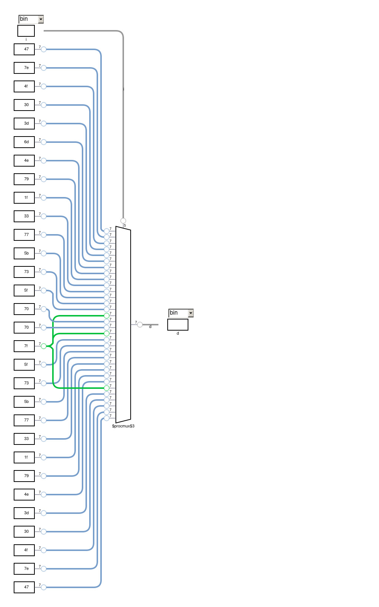

# Parte 1

Utilizando a linguagem de descrição de hardware (HDL) Verilog, o diagrama esquemático (RTL) será implementado com quatro técnicas distintas: Primitivas ou Rede de Ligações, Declarações Concorrentes com Operadores Lógicos, Declarações Concorrentes com Operador Ternário e Declaração Procedural ou Comportamental. <br>

Para a implementação desse decodificador, foi construido a seguinte tabela verdade:

<details>
    <summary> Tabela Verdade</summary>

| bit3 | bit2 | bit1 | bit0 | T | a | b | c | d | e | f | g |
|------|------|------|------|---|---|---|---|---|---|---|---|
| 0    | 0    | 0    | 0    | 0 | 1 | 0 | 0 | 0 | 1 | 1 | 1 |
| 0    | 0    | 0    | 0    | 1 | 1 | 1 | 1 | 1 | 1 | 1 | 0 |
| 0    | 0    | 0    | 1    | 0 | 1 | 0 | 0 | 1 | 1 | 1 | 1 |
| 0    | 0    | 0    | 1    | 1 | 0 | 1 | 1 | 0 | 0 | 0 | 0 |
| 0    | 0    | 1    | 0    | 0 | 0 | 1 | 1 | 1 | 1 | 0 | 1 |
| 0    | 0    | 1    | 0    | 1 | 1 | 1 | 0 | 1 | 1 | 0 | 1 |
| 0    | 0    | 1    | 1    | 0 | 1 | 0 | 0 | 1 | 1 | 1 | 0 |
| 0    | 0    | 1    | 1    | 1 | 1 | 1 | 1 | 1 | 0 | 0 | 1 |
| 0    | 1    | 0    | 0    | 0 | 0 | 0 | 1 | 1 | 1 | 1 | 1 |
| 0    | 1    | 0    | 0    | 1 | 0 | 1 | 1 | 0 | 0 | 1 | 1 |
| 0    | 1    | 0    | 1    | 0 | 1 | 1 | 1 | 0 | 1 | 1 | 1 |
| 0    | 1    | 0    | 1    | 1 | 1 | 0 | 1 | 1 | 0 | 1 | 1 |
| 0    | 1    | 1    | 0    | 0 | 1 | 1 | 1 | 0 | 0 | 1 | 1 |
| 0    | 1    | 1    | 0    | 1 | 1 | 0 | 1 | 1 | 1 | 1 | 1 |
| 0    | 1    | 1    | 1    | 0 | 1 | 1 | 1 | 1 | 1 | 1 | 1 |
| 0    | 1    | 1    | 1    | 1 | 1 | 1 | 1 | 0 | 0 | 0 | 0 |
| 1    | 0    | 0    | 0    | 0 | 1 | 1 | 1 | 0 | 0 | 0 | 0 |
| 1    | 0    | 0    | 0    | 1 | 1 | 1 | 1 | 1 | 1 | 1 | 1 |
| 1    | 0    | 0    | 1    | 0 | 1 | 0 | 1 | 1 | 1 | 1 | 1 |
| 1    | 0    | 0    | 1    | 1 | 1 | 1 | 1 | 0 | 0 | 1 | 1 |
| 1    | 0    | 1    | 0    | 0 | 1 | 0 | 1 | 1 | 0 | 1 | 1 |
| 1    | 0    | 1    | 0    | 1 | 1 | 1 | 1 | 0 | 1 | 1 | 1 |
| 1    | 0    | 1    | 1    | 0 | 0 | 1 | 1 | 0 | 0 | 1 | 1 |
| 1    | 0    | 1    | 1    | 1 | 0 | 0 | 1 | 1 | 1 | 1 | 1 |
| 1    | 1    | 0    | 0    | 0 | 1 | 1 | 1 | 1 | 0 | 0 | 1 |
| 1    | 1    | 0    | 0    | 1 | 1 | 0 | 0 | 1 | 1 | 1 | 0 |
| 1    | 1    | 0    | 1    | 0 | 1 | 1 | 0 | 1 | 1 | 1 | 0 |
| 1    | 1    | 0    | 1    | 1 | 0 | 1 | 1 | 1 | 1 | 0 | 1 |
| 1    | 1    | 1    | 0    | 0 | 0 | 1 | 1 | 0 | 0 | 0 | 0 |
| 1    | 1    | 1    | 0    | 1 | 1 | 0 | 0 | 1 | 1 | 1 | 1 |
| 1    | 1    | 1    | 1    | 0 | 1 | 1 | 1 | 1 | 1 | 1 | 0 |
| 1    | 1    | 1    | 1    | 1 | 1 | 0 | 0 | 0 | 1 | 1 | 1 |

</details>

---


### Mapas de Veitch-Karnaugh

A partir da tabela verdade foi possível desenvolver os mapas de Veitch-Karnaugh:

<div align ="center">
    
</div>

Com isso, verificou-se as seguintes expressões booleana de saída:
<br>

``` bash
a = (/bit2 /bit1 /bit0) + (/bit3 bit0 /T) + (/bit3 bit1 T) + (/bit3 bit2 bit0) + (bit2 bit0 /T) + (/bit3 bit2 bit1) + (bit2 bit1 T) + (bit3 /bit2 /bit1) + (bit3 /bit2 /bit0) + (bit3 /bit1 /bit0)

b = (/bit3 /bit2 T) + (/bit3 /bit1 /bit0 T) + (/bit2 /bit0 T) + (/bit3 bit1 /bit0 /T) + (bit2 bit0 /T) + (/bit3 bit2 bit1 bit0) + (bit3 /bit2 /bit1 /bit0) + (bit3 /bit1 bit0 T) + (bit3 bit1 bit0 /T) + (bit3 bit2 /T)

c = (/bit2 /bit1 T) + (/bit2 bit0 T) + (/bit1 bit0 T) + (bit1 /bit0 /T) + (/bit3 bit2) + (bit3 /bit2) + (bit3 /bit0 /T) + (bit3 bit1 /T)

d = (/bit2 /bit1 /bit0 T) + (/bit2 /bit1 bit0 /T) + (/bit3 /bit2 bit1) + (/bit2 bit1 /bit0 /T) + (/bit2 bit1 bit0 T) + (bit2 /bit1 /bit0 /T) + (bit2 /bit1 bit0 T) + (bit2 bit1 /bit0 T) + (bit2 bit1 bit0 /T) + (bit3 bit2 /bit1)

e = (/bit3 /bit2 /bit0) + (/bit3 /bit1 /T) + (/bit3 bit0 /T) + (/bit1 bit0 /T) + (bit1 /bit0 T) + (bit3 /bit0 T) + (bit3 bit1 T) + (bit3 bit2 bit0)

f = (/bit3 /bit1 /bit0) + (/bit1 /bit0 T) + (bit0 /T) + (/bit3 bit2 /bit1) + (/bit3 bit2 /bit0) + (bit3 /bit2 bit0) + (bit3 /bit2 bit1) + (bit3 bit1 T)

g = (/bit3 /bit1 /T) + (/bit3 bit1 /bit0) + (/bit2 bit1 T) + (/bit3 bit2 /bit1) + (/bit3 bit2 /T) + (bit2 /bit1 /bit0 /T) + (bit3 /bit2 T) + (bit3 /bit2 bit0) + (bit3 bit0 T) + (bit3 /bit2 bit1) + (bit3 bit1 T)
```

---
### Modularização do circuito lógico por declaração procedural

<div align ="center">
    
</div>

---
### Lógica de funcionamento

<div align ="center">
    
</div>

---

