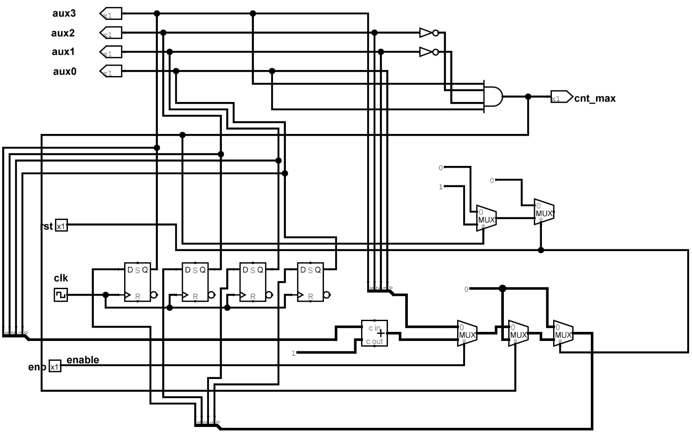

# Parte 2
 ...

 A segunda parte do trabalho vigente consiste no desenvolvimento didático de três contadores compostos pelas estruturas clássicas (síncrona ou assíncrona) de flip-flops tipo D encadeados. Nesse sentido, cada um deve conter um algoritmo único, a saber: implementação modular para contagem síncrona e para assíncrona, implementação unitária com incremento e declaração procedural.    

Inicialmente, foi desenvolvido um diagrama de estados para o contador de 4 bits o qual é aplicado no ciclo que inicia em 0000, para o número 0, e termina em 1001, para o número 9, conforme a seguinte imagem: 

    

Em seguida, utilizando flip flop Tipo-D para 4 bits, foi montada um tabela de excitação para a contagem de década:  

    

A partir dos dados analisados, foi possível a obtenção das expressões booleanas que descrevem o circuito, por meio da utilização de Mapas de Karnaught, conforme:  

    

    

    

    

