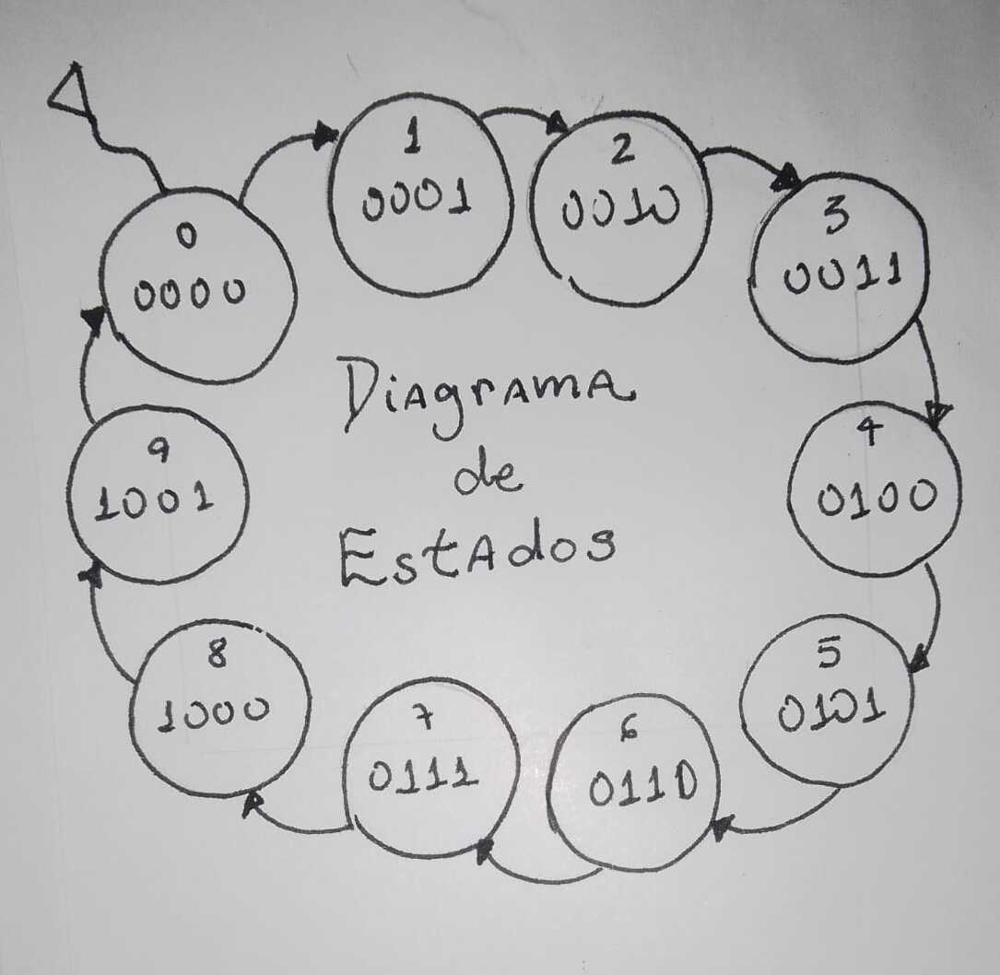
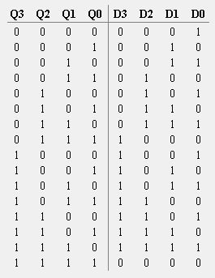
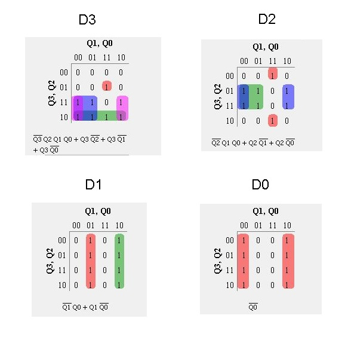
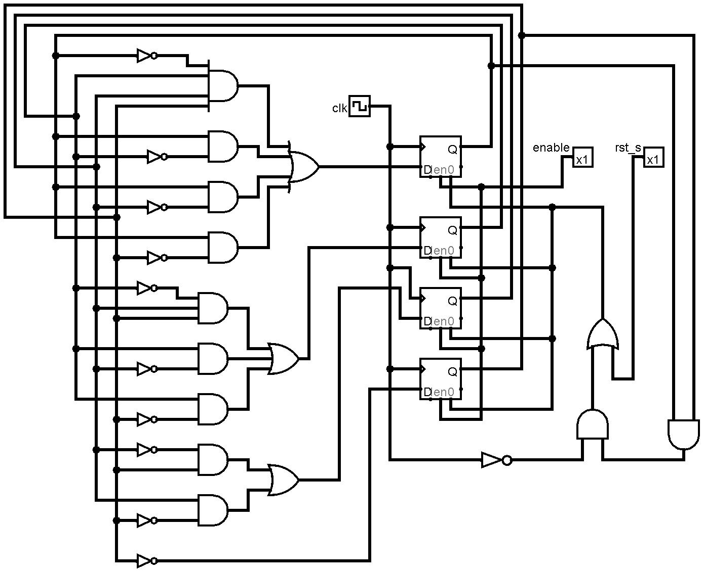
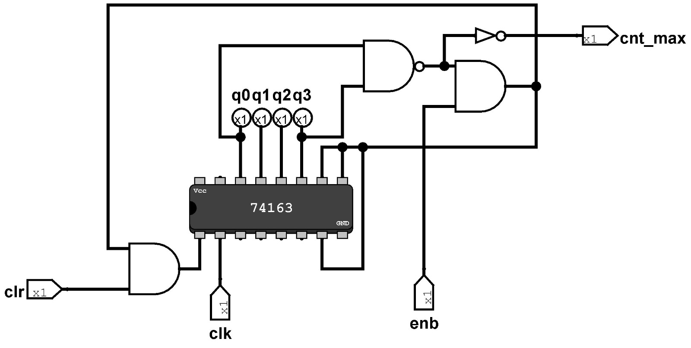

# Parte 2

A segunda parte do trabalho vigente consiste no desenvolvimento didático de três contadores compostos pelas estruturas clássicas (síncrona ou assíncrona) de flip-flops tipo D encadeados. Nesse sentido, cada um deve conter um algoritmo único, a saber: implementação modular para contagem síncrona e para assíncrona, implementação unitária com incremento e declaração procedural. A seguir, será apresentado a metodologia utilizada para o desenvolvimento de um contador síncrono crescente de década (BCD).  

Inicialmente, foi desenvolvido um diagrama de estados para o contador de 4 bits o qual é aplicado no ciclo que inicia em 0000, para o número 0, e termina em 1001, para o número 9, conforme a seguinte imagem: 

    

 
Em seguida, utilizando flip flop Tipo-D para 4 bits, foi montada uma tabela de excitação para a contagem de década:   

    

 
A partir dos dados analisados, foi possível a obtenção das expressões booleanas que descrevem o circuito, por meio da utilização de Mapas de Karnaught, conforme:   

    

 
Em posse das expressões booelanas, foi possível a criação do circuito lógico que descreve o contador de década utilizando flip flops D:    

    

Por fins didáticos, é válido mencionar que o circuito apresentado pode ser também implemetado a partir do circuito integrado 74163, assim como apresentado:    

    

